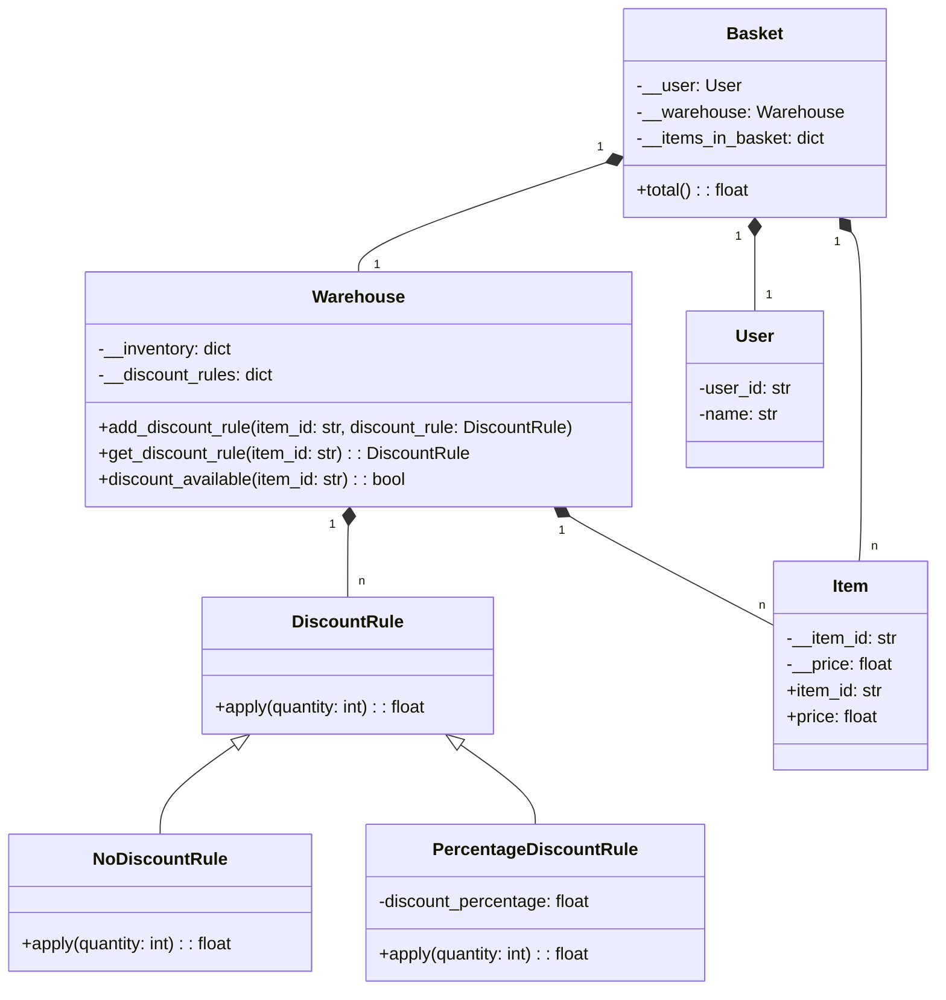

# coding-challenge

Implementation of the [coding challenge]([https://duckduckgo.com](https://gist.github.com/N3mezis/e058340930a385d4d4aac513cd0f1c1a#file-codingchallenge-md)) from bitside 

```mermaid
classDiagram
    class DiscountRule {
        +apply(quantity: int): float
    }

    class NoDiscountRule {
        +apply(quantity: int): float
    }

    class PercentageDiscountRule {
        -discount_percentage: float
        +apply(quantity: int): float
    }

    class Warehouse {
        -__inventory: dict
        -__discount_rules: dict
        +add_discount_rule(item_id: str, discount_rule: DiscountRule)
        +get_discount_rule(item_id: str): DiscountRule
        +discount_available(item_id: str): bool
    }

    class Basket {
        -__user: User
        -__warehouse: Warehouse
        -__items_in_basket: dict
        +total(): float
    }

    class Item {
        -__item_id: str
        -__price: float
        +item_id: str
        +price: float
    }

    class User {
        -user_id: str
        -name: str
    }

    DiscountRule <|-- NoDiscountRule
    DiscountRule <|-- PercentageDiscountRule
    Warehouse "1" *-- "n" Item
    Warehouse "1" *-- "n" DiscountRule
    Basket "1" *-- "1" Warehouse
    Basket "1" *-- "n" Item
    Basket "1" *-- "1" User

```