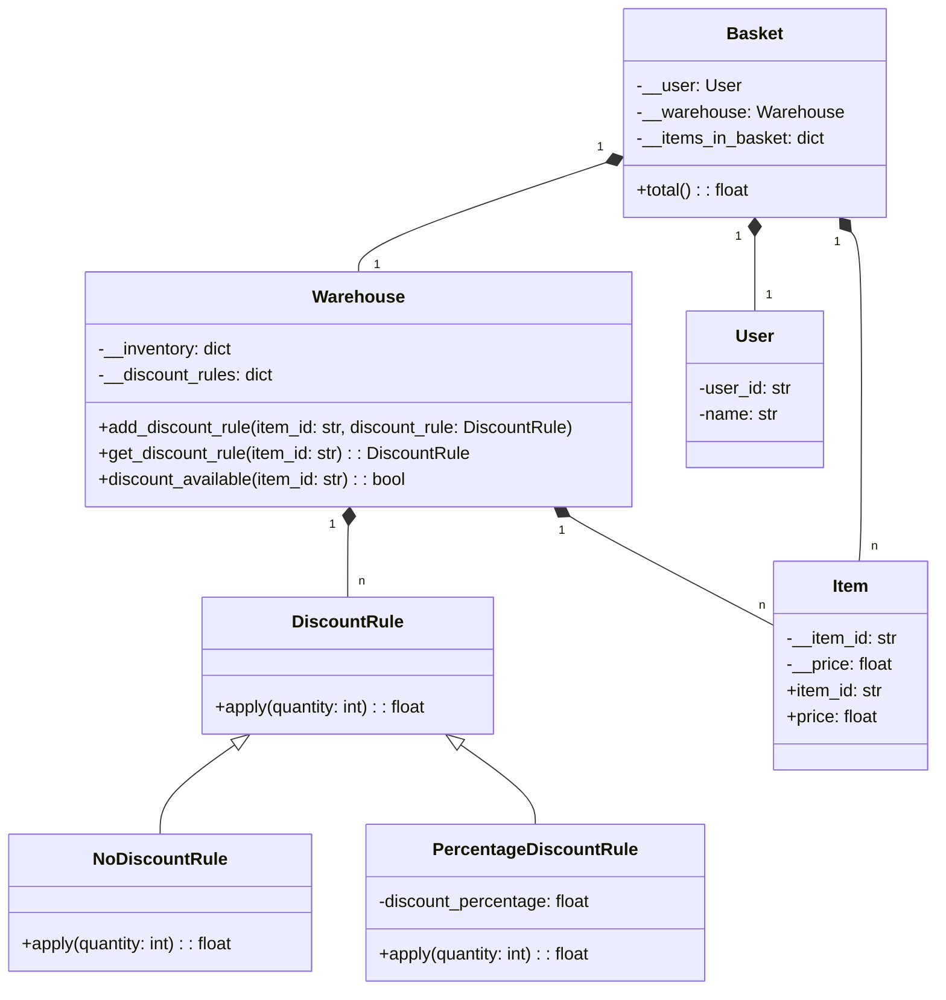

# coding-challenge

Implementation of the [coding challenge]([https://duckduckgo.com](https://gist.github.com/N3mezis/e058340930a385d4d4aac513cd0f1c1a#file-codingchallenge-md)) from bitside 

# Assumptions

The following assumptions were made for the project:

- There can only ever be one DiscountRule for each item.
- DiscountRules are always linked to an item and independent of other items (i.e. it is not possible to say that if item A is purchased 5 times then item B is 1 time free).
- There are no discounts on the entire basket.
- If an item is no longer available in the warehouse, it will no longer be purchased and is therefore no longer listed.

# How to extend

An attempt was made to implement the challenge according to the following principles:

- Strategy pattern for price calculation
- Single reponsibility principle
- Open close principle

If, for example, new rules are to apply to the entire shopping basket, a BasketDiscount rule can be inserted, which also inherits from DiscountRule. In this way, it would also be possible to define rules that apply to the entire shopping basket. However, a number of other business logics would then have to be taken into account.

# Auto generated class diagram of implementation

